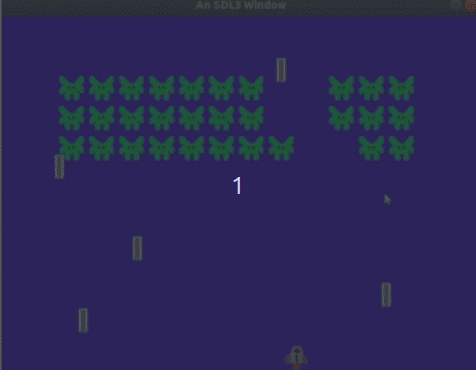

# Space Invaders 

> "Look out!"

# Resources to help

Provided below are a list of curated resources to help you complete the task(s) below. Consult them (read them, or do ctrl+f for keywords) if you get stuck.

| D Programming Related Links                         | Description                       |
| --------------------------------------------------  | --------------------------------- |
| [My D Youtube Series](https://www.youtube.com/playlist?list=PLvv0ScY6vfd9Fso-3cB4CGnSlW0E4btJV) | My video series playlist for learning D Lang. |
| [DLang Phobos Standard Library Index](https://dlang.org/phobos/index.html)  | The Phobos Runtime Library (i.e. standard library of code.)
| [D Language Tour](https://tour.dlang.org/)           | Nice introduction to the D Language with samples you can run in the browser. |
| [Programming in D](https://ddili.org/ders/d.en/)     | Freely available D language programming book |
| [My SDL Playlist](https://www.youtube.com/playlist?list=PLvv0ScY6vfd-p1gSnbQhY7vMe2rng0IL0)     | My SDL Playlist |

## Description

Word is getting around that there is a new gamemaker! The industry is getting positive buzz as famed gamemakers [Nolan Bushnell](https://en.wikipedia.org/wiki/Nolan_Bushnell) and [Shigeru Miyamoto](https://en.wikipedia.org/wiki/Shigeru_Miyamoto) have been talking about your game development skills. They have even offered you a handsome sum of money -- but you have said **no way!**. Dynamics change rapidly in the game industry--thus you have decided to form a new game studio of your own. From your previous assignments, you have sharpened your skills and have a nice codebase with your own intellectual property, and you have decided to form a 'game making' studio around this technology. Building an impressive piece of middleware (i.e. a tool or technology that is not a game) to showcase at the giant tradeshows ([PAX East](http://east.paxsite.com/), [GDC](https://www.gdconf.com/), and [formerly E3](https://www.e3expo.com/), etc.) is your ultimate goal -- and how to get there? Build some games!

For this PSET I am going to let you loose so to speak and you are going to create a demo for the game 'space invaders'. The goal is to take this time to start putting together various things you have learned in to a game project. We'll continue moving forward with more topics in a few PSETs, but now is a good point to build your next graphical game project!

## Space Invaders

If you have not yet played space invaders, here is a sample: https://freeinvaders.org/#google_vignette

Please take a few minutes to play so you are familiar with the game if you have never played before.

## The assignment

My expectation for this assignment is you will create something like the above image.

- There should be some enemies that fire projectiles.
	- Note: In the past students have choosen less destructive things such as stars, hearts, pumpkins, etc. -- feel free to be creative and/or peaceful :)
- There should be a 'hero' that can fire back.
	- The hero should be able to fire some type of 'projectile' to remove enemies when they are hit.
- If the player is hit by a projectile the game ends, or otherwise if all enemies are eliminated the game ends.
- I expect you can create some basic images (in a program like [GNU GIMP](https://www.gimp.org/), paint, photoshop, etc.) to distinguish between the enemies.

### Other Notes:

[SDL_HasRectIntersection](https://wiki.libsdl.org/SDL3/SDL_HasRectIntersection) (or [SDL_IntersectRect](https://wiki.libsdl.org/SDL2/SDL_IntersectRect) for SDL2) may be a helpful function for you to create a collision component using boxes.

## Requirements

- Core Game
	1. You **must** have a Game Loop and Game Application 
		- i.e. I do not want to see you implement the whole game in 'main'
	2. Your game **must** be frame capped to 60 FPS
	3. You **must** have one level of the game.
- Game Objects
  	1. You **need** to have a 'GameObject' or 'GameEntity' class.
	2. You **need** to implement the 'Component Pattern'
    	- 'Component Pattern', such that the 'GameObject' is a holder of between 0..n compoments.
  		- Components can be either objects themselves or 'handles' to objects. That is your decision.
	4. You **need** implement a 'Script Component' for handling the logic.
   		- My recommendation is to have a directory for scripts, and have a script component deriving a new type for: PlayerScript, AlienScript, and ProjectileScript.
  		- Scripts can be their own dynamic array part of the Game Object, or otherwise part of a component map, your choice.
 	5. You **need** incorporate at least 1 sprite animation in your project
  		- This can be as simple as a two frame animation as displayed below.
 			- 
			- I would encourage you to use a program like the free [GNU GIMP](https://www.gimp.org/) to create a simple sprite sheet.
   	6. You *might* use 'factories' for creating Game Objects (i.e. otherwise have some way to quickly 'MakeSprite' or 'MakeAnimatedSprite' without having to build from scratch a game object with individual compoments each time).
    7. You *might* use the state pattern if you find it useful. 
- Game Engine
	1. Resource Management
		- You **need** implement a ResourceManager such that any resource (e.g. an image, sprite sheet, etc.) is loaded through the resource manager.
	  		- There's a little bit of wiggle room here, but ideally references to the same SDL_Texture or SDL_Image should be shared.
  			- And yes, even if you included all of your sprites into a single sprite sheet, you'll still load that resource through a resource manager.

Note: Highlighted in bold are the terms 'need' and 'must' which are **hard** requirements. Other bulleted items excluding these words are likely 'good ideas', to implement or eventually implement.

## How to compile and run your program

1. You can use simply run `dub` file to build and run the project.
   - Note: `dub test` by default does a debug build.
   - Don't forget to use [gdb](https://www.youtube.com/watch?v=NWsZrN7gXYg) or [lldb](https://www.youtube.com/watch?v=drzvDkU-H54) if you run into errors!

# Submission/Deliverables

### Submission

- Commit all of your files to github, including any additional files you create.
- Do not commit any binary files unless told to do so.
- Do not commit any 'data' files generated when executing a binary.

### Deliverables

- A demo of a space invaders game that meets the above requirements.

# Going Further

An optional task(if any) that will reinforce your learning throughout the semester--this is not graded.

Several of the below will be upcoming requirements, but if you want to work ahead or think about these for your future assignments, feel free to.

1. You can add sound or music if you like.
2. You can add a 'score' system either in the terminal, or by creating a bitmap font.
3. A scene structure for parsing different levels.
4. You can have your scene load from a .json file and populate the game objects with data.

# F.A.Q. (Instructor Anticipated Questions)

0. Q: I don't understand where to start?
   - A: This is a pretty creative assignment when it comes to code design.
   - Start with what you know -- creating a game loop.
   - You can reference previous code that I have provided (with citation). For instance, I have provided many examples of how to get an SDL window up and running.
   - Then consider how to draw a texture to the window and move it around.
   - If you can do that, then you can implement space invaders.
     	- For things like projectiles, you might have some specific behaviors that you want certain game objects to have (i.e. moving the projectiles and checking for collision).
2. Q: Can I build out a full game with multiple levels and a configuration file to setup the game?
    - A: Sure, but don't worry, that's the direction we are heading!
